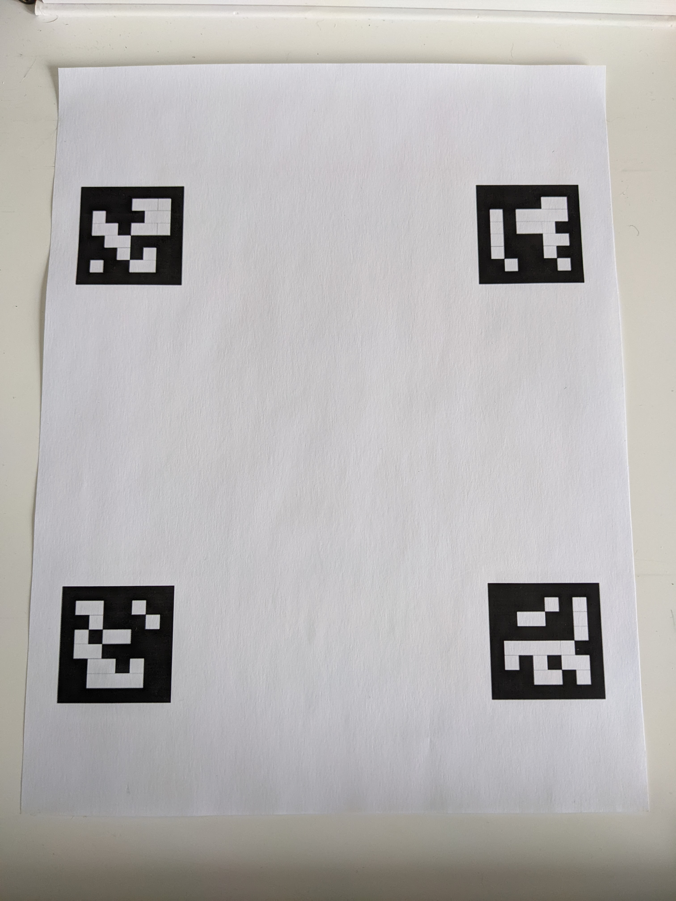
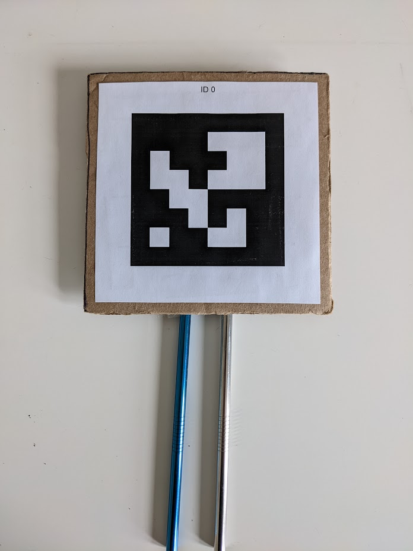
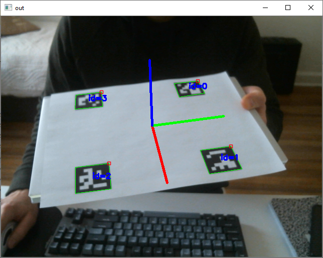
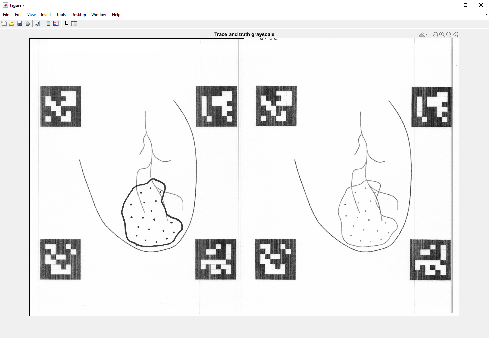
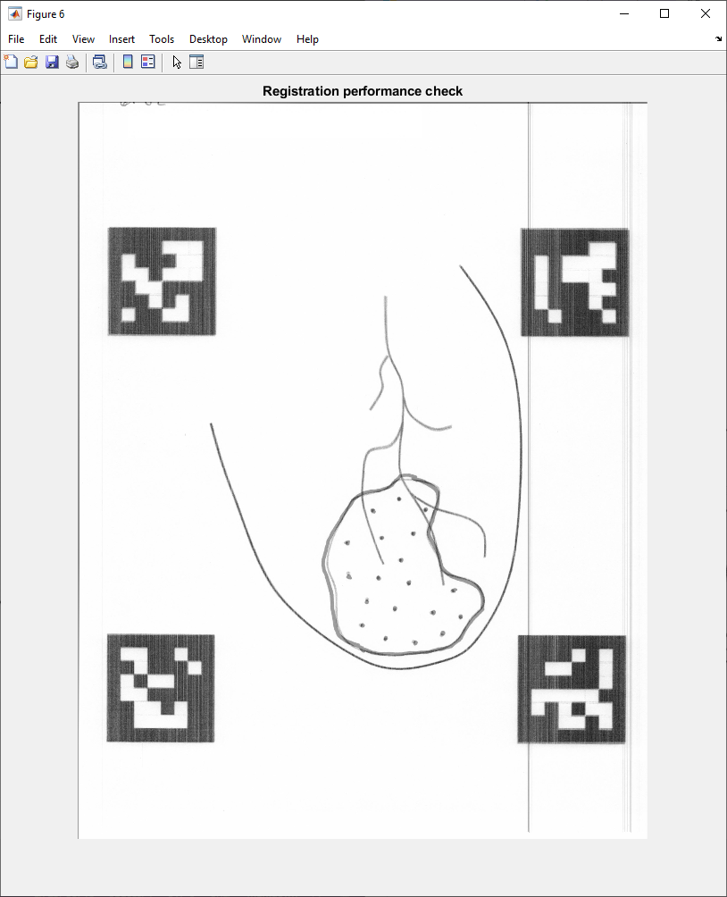
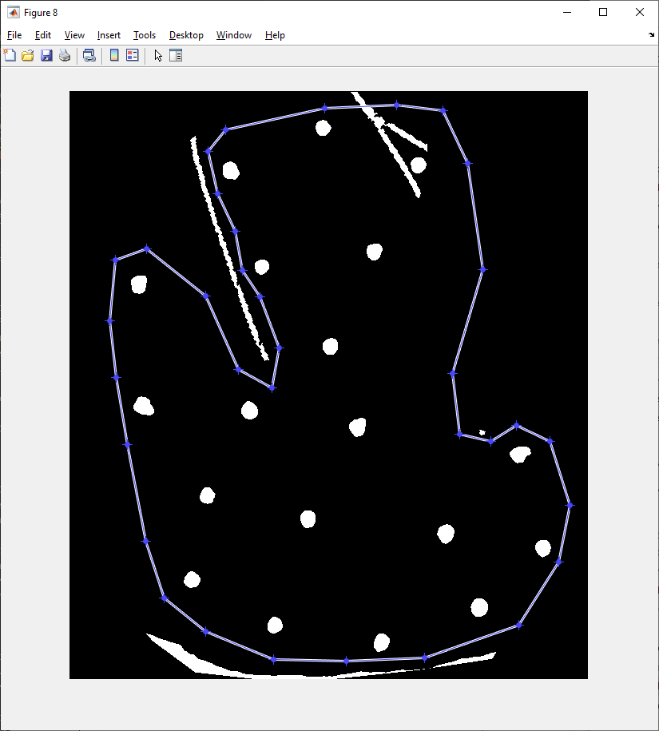
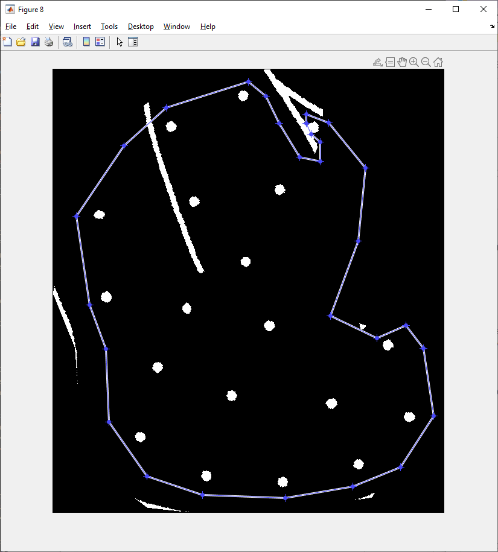
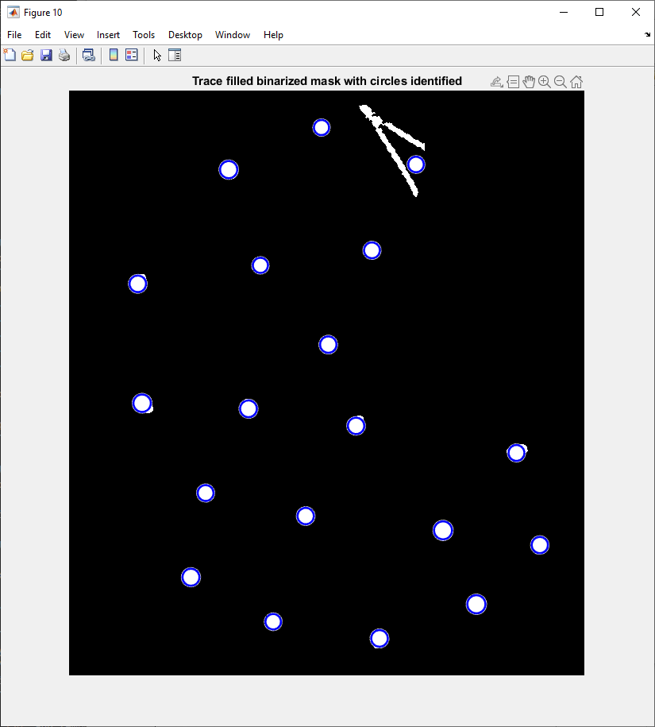
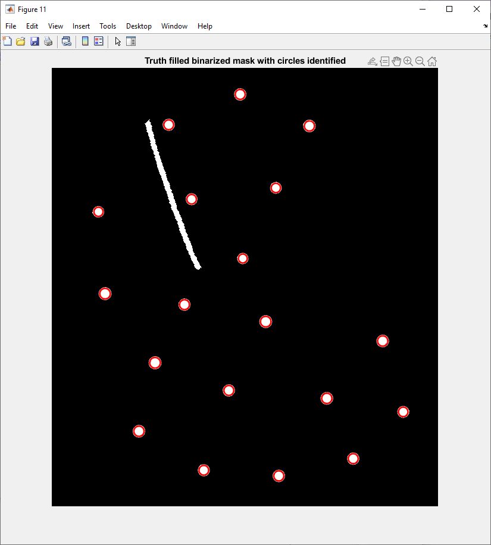
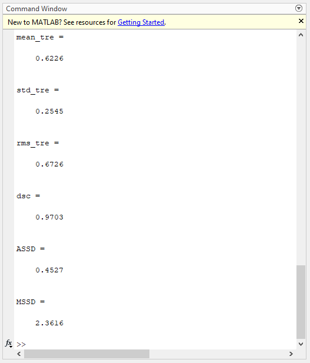

# Display Calibration HoloLens
Point correspondence-based display calibration and ArUco marker tracking for the HoloLens 2. 

This is the accompanying GitHub repo for our paper investigating the perceptual accuracy of manual tasks using an optical see-through head-mounted display (OST-HMD) for guidance:
- [Head-Mounted Display-Based Augmented Reality for Image-Guided Media Delivery to the Heart: A Preliminary Investigation of Perceptual Accuracy](https://www.mdpi.com/2313-433X/8/2/33/htm)

## Table of contents
- [Project setup](#project-setup)
- [Data](#data)
- [Running on the HoloLens 2](#running-on-the-hololens-2)
- [Evaluation](#evaluation)
- [Citation](#citation)

## Project setup
Folder setup for the project sample.
```
data/
... GroundTruths/
... MarkerConfig/
... SampleResults/
... ... Figures/
... ... Matlab/
... ... Traces/
... ... Truths/
... TraceTargets/
... TraceTemplate/

unity-sandbox/
... CustomArUcoBoards/
... HoloLens2-Display-Calibration/
... OpenCVRuntimeComponent/
```

## Data
We have included the ArUco board tracking configuration that we used in our study, along with the calibration marker used for per-user display calibration. There are several test cases of scanned user-trace results available in the `data/SampleResults/Traces` folder. Additionally, we have included the relevant Matlab scripts used for processing the user-trace data and computing relevant metrics of accuracy.

### Printing the required calibration object and tracking board
To be able to use this repo for tracking and display calibration, we need to first print off the required materials.
1. In the `data/TraceTemplate/` folder, open the `trace_template.pdf` document (or `data/MarkerConfig/` and the `board_config.pdf` document) and print at 100% scale (actual document size). Attach/tape down the trace template onto a flat object to hold it in place during tracking.




2. In the `data/MarkerConfig/` folder, open the `calibration_marker_config.pdf` document and print at 100% scale. Create a calibration marker as shown below using cardboard and a handle.



You now have the materials prepared for calibration and tracking.

### *Optional: Confirming the board object for tracking*
- Open the `CustomArUcoBoards` solution in Visual Studio
- Using the Nuget package manager console, install the `OpenCV.Windows.3411.0.0.nupkg` NuGet package to the `CustomArUcoBoards` project 
```
Install-Package ..\OpenCV.Windows.3411.0.0.nupkg -ProjectName CustomArUcoBoards
```
- `CustomArUcoBoards` is a sandbox environment set up to test the performance of custom ArUco board object tracking
- Run the sample (`x64` or `x86`), a window will appear showing the created ArUco markers (which will be saved as images), press escape to close each window
- If you have a webcam on your PC, the video stream will open allowing for testing of the board configuration object by printing the board (as image below)
- In this example, we used the PDF located at `data/MarkerConfig/board_config.pdf` for configuring the ArUco tracking board object



## Running on the HoloLens 2
### About
- In this sample I am using build 19041.1161 (Windows Holographic, version 20H2 - August 2021 Update) which can be downloaded from MSFT via the following [link](https://aka.ms/hololens2download/10.0.19041.1161) and installed using the [Advanced Recovery Companion](https://www.microsoft.com/en-ca/p/advanced-recovery-companion/9p74z35sfrs8?rtc=1&activetab=pivot:overviewtab)
- Tested with Unity 2019.4 LTS, Visual Studio 2019, and the HoloLens 2

### *Optional: Camera calibration for the HoloLens 2*
- We found that there was better accuracy of marker-based registration while using the intrinsics provided by the `VideoMediaFrame.CameraIntrinsics.UndistortedProjectionTransform` utility, though you are welcome to try a standard camera calibration procedure to see if your accuracy improves. There are more details of how to do this in [another repo of mine](https://github.com/doughtmw/ArUcoDetectionHoloLens-Unity/blob/master/README.md#:~:text=Camera%20calibration%20for%20the%20HoloLens%202).

### *Optional*: Build runtimes from source for ARM64 
- Open the `OpenCVRuntimeComponent` solution in Visual Studio
- Using the Nuget package manager console, install the `OpenCV.HoloLens.3411.0.0.nupkg` NuGet package to the `OpenCVRuntimeComponent` project 
```
Install-Package ..\OpenCV.HoloLens.3411.0.0.nupkg -ProjectName OpenCVRuntimeComponent
```
- `OpenCVRuntimeComponent` takes video frames from the C# Unity project and performs the tasks of marker tracking using the ArUco library and rigid transform estimation for display calibration 
- The sample uses the Universal Windows Platform and can be built to `.winmd` and `.dll` files which are used for the HoloLens 2 app
  - Output build directory `OpenCVRuntimeComponent/ARM64/(Release/Debug)/OpenCVRuntimeComponent/`
- For use in Unity, copy the files in the output build directory above to the `unity-sandbox/HoloLens2-Display-Calibration/Assets/Plugins/ARM64/` folder

### Deploy and run the sample on the HoloLens 2
- *Optional*: If `OpenCVRuntimeComponent` was built from source, copy `.winmd`, `.dll` and `.lib` files from `OpenCVRuntimeComponent/ARM64/(Release/Debug)/OpenCVRuntimeComponent/` to the Unity plugins directory `unity-sandbox/HoloLens2-Display-Calibration/Assets/Plugins/ARM64/` folder

Open `HoloLens2-Display-Calibration` in Unity. There are several different scenes available for selection in the `Assets/Scenes/` folder, as detailed in our paper, these will determine which tracing paradigm (adjacent, direct, or calibrated) will be used for the experiment

1. `hmd adjacent`: There is no calibration procedure required, when looking at the printed trace template, you will see a virtual model augmented adjacent to the tracking target.
-	View ground truth template adjacent to paper template

2. `hmd calib`: There is an additional calibration procedure required, with 10 point correspondences collected per eye. For the point collection process you need to align the tracked marker corners with the virtual on-screen reticle and press spacebar on a bluetooth or USB keyboard connected to the HoloLens 2 (or use the double-tap gesture) to collect that point correspondence. Virtual marker positions will change slightly across each calibration point correspondence. 
- Begin calibration with your right eye (left eye closed), next calibrate left eye (right eye closed)


After completing calibration, set down the calibration object and look at the printed trace template. You should now see a virtual model augmented directly on the tracking target.
- View ground truth template aligned with paper template

3. `hmd`: There is no additional calibration required, when looking at the printed trace template, you will see a virtual model augmented directly on the tracking target.
- View ground truth template aligned with paper template

After selecting the desired tracking scene, we can now build the scene to the device.
- Switch build platform to `Universal Windows Platform`, select `HoloLens` for target device, and `ARM64` as the target platform
- Using the MRTK build window, build the solution and deploy the `.appx` file to the HoloLens 2

## Evaluation 
Evaluation of the user trace performance relative to ground truth points and contours was performed in Matlab.
- Using matlab tool located in `data/SampleResults/Matlab` folder, open the `Main.m` script
- The desired scanned user-trace result can be modified (default is `data/Traces/calib_gt_02.jpg`) to one of the included test samples
  - Also be sure to modify the selected ground truth to reflect the user-trace template (e.g. `Traces/calib_gt_02.jpg` uses `Truths/GT_02.jpg` as a ground truth template)
- Running the Matlab script will present the following outputs:
- The selected user trace and ground truth
  

  
- A confirmation of registration of the two scans (check the overlap of the ArUco marker targets to confirm)



- Trace and truth processing (manual input required, double click final point to confirm selection) to encircle the user-drawn or ground truth simulated injection points

<p float="left">
  
  
</p>

- Trace and truth circle fit confirmation, ensure that the correct injection points have been selected

<p float="left">
  
  
</p>

- And the final resulting script output including mean and standard deviation target registration error (mm) of the points and average symmetric surface distance (mm) of the contour



## Citation
If you found this code repo useful, please consider citing the associated publication:
```
@article{jimaging8020033,
    author={Doughty, Mitchell and Ghugre, Nilesh R.},
    title={Head-Mounted Display-Based Augmented Reality for Image-Guided Media Delivery to the Heart: A Preliminary Investigation of Perceptual Accuracy},
    journal={Journal of Imaging},
    volume={8},
    year={2022},
    number={2},
    article-number={33},
    url={https://www.mdpi.com/2313-433X/8/2/33},
    issn={2313-433X},
    doi = {10.3390/jimaging8020033}
}
```
